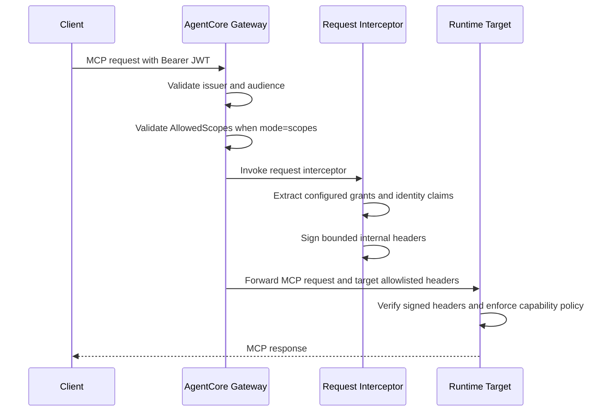

# Gateway Hub

The Gateway hub is the shared MCP entry point for an environment. It
authenticates callers, routes MCP requests to registered targets, and passes
the trusted context each target needs.

## Shared Hub Resources

`infrastructure/bootstrap.yaml` creates the environment-level resources:

- AgentCore Gateway
- Gateway IAM role
- versioned artifact/config S3 bucket
- JWT/OIDC authorization configuration
- request interceptor Lambda
- Secrets Manager header-signing secret
- CloudWatch log retention for the interceptor

These resources are shared by all targets in the same environment. Runtime
targets register with the hub through their GatewayTarget configuration.

## Request Flow



The Runtime must fail closed when trusted headers are missing, unsigned, stale,
or tampered with. Gateway validation is necessary but not the only enforcement
point.

## Authorization Modes

The hub supports two inbound grant modes:

- `scopes`: Gateway configures `AllowedScopes`. Use this for delegated OAuth
  scopes such as Microsoft Entra ID `scp`. Accepted claims must be limited to
  `scope` and `scp`.
- `claims`: Gateway validates issuer and audience only. The interceptor and
  Runtime enforce grants from configured claims such as Entra ID `roles`.
  Accepted claims must be `roles`.

The request interceptor replaces caller-supplied internal authorization headers.
It emits:

- `x-data-agent-grants`
- `x-data-agent-identity`
- `x-data-agent-issued-at`
- `x-data-agent-signature`

Targets allowlist only the headers they require. The database Runtime
propagates `Mcp-Session-Id` for Runtime microVM affinity.

## Capability Contract

Capabilities declare the authorization and downstream identity expectations for
one exposed tool:

```yaml
capabilities:
  - name: ask_database
    target: data-agent
    identity_mode: service
    required_grants: [data:read]
    sql_viewer_grant: data:sql:read
```

Recommended fields:

- `name`: tool or capability name exposed through MCP.
- `target`: GatewayTarget name that hosts the capability.
- `identity_mode`: `service` or `on_behalf_of_user`.
- `required_grants`: grants required before the Runtime executes the tool.
- `downstream_audience`: required for delegated downstream access.
- `credential_provider_name`: required when the target uses AgentCore Identity
  or another approved OBO credential provider.

## Identity Modes

`identity_mode: service` means the target uses its own technical identity for
downstream access. The caller is authorized to invoke the capability, but the
downstream system sees the target's fixed service identity.

Examples:

- read-only database access through a technical PostgreSQL role
- knowledge-base retrieval through a fixed service role
- internal inventory API with a target service account

`identity_mode: on_behalf_of_user` means the target must access a downstream
system with delegated caller authority. The target must declare the downstream
audience and use AgentCore Identity or an approved equivalent token-exchange
pattern.

Examples:

- SharePoint document search with user-level permissions
- Jira issue operations with user-level authorization
- Salesforce access governed by caller entitlements

Do not pass raw inbound bearer tokens to every target as a generic convenience.
Only the target that performs delegated access should receive the minimum
token-exchange context required by its credential-provider flow.

## Target Templates

`infrastructure/target.yaml` is intentionally limited to IAM-authorized
AgentCore Runtime MCP targets:

- `CredentialProviderType: GATEWAY_IAM_ROLE`
- Runtime endpoint URL generated from the deployed Runtime ARN
- target-specific request/response header allowlists

This is the template for the database Runtime path.

`infrastructure/target-mcp-oauth-obo.yaml` is the template for MCP targets that
need AgentCore Identity/outbound OAuth authorization. It keeps OBO
credential-provider settings out of the database target contract.

When OBO targets need Gateway role permissions for AgentCore Identity token
vending, deploy `infrastructure/gateway-identity-permissions.yaml` for that
environment.

## Adding A New Target

Treat each target as a new module. Define:

- target name and exposed tools
- required grants
- identity mode
- allowed request and response headers
- downstream credential-provider settings when OBO is needed
- audit fields
- data minimization rules
- deterministic domain guardrails
- resource-specific residual risks

The target should live in its own package under `app/capabilities/<module>/`
unless it is implemented by a separate Runtime codebase.

## Deployment Boundary

`scripts/deploy.sh` deploys database Runtime targets that use
`GATEWAY_IAM_ROLE`. It parameterizes the Runtime instance and target name, but
OBO targets use their dedicated target template and deployment path.

Use a dedicated deployment path for OBO targets so an OAuth/OBO configuration
cannot silently deploy as an IAM-authorized database target.
