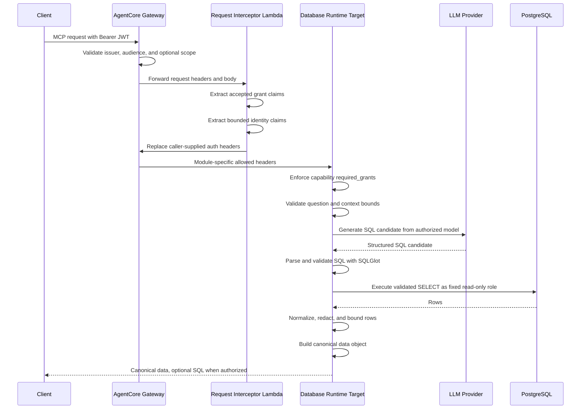

# Security Architecture

This document describes the security architecture of the modular tool hub
deployed with Amazon Bedrock AgentCore Gateway and AgentCore Runtime. It focuses
on trust boundaries, threat mitigations, and production controls.

Layer-specific operational details live in:

- [Gateway hub](gateway_hub.md) for shared Gateway, interceptor, target, and
  identity-mode contracts.
- [Database Runtime](database_runtime.md) for `ask_database`, SQL validation,
  PostgreSQL preparation, and multiple database-agent instances.
- [Microsoft Entra ID setup](entra_id_setup.md) for a practical OIDC provider
  setup and token validation flow.

The read-only database capability, `ask_database`, is deployed behind the
shared Gateway hub. Each module declares its own authorization grants,
downstream identity model, header contract, audit requirements, and data
minimization rules.

## Executive Summary

AgentCore Gateway is the security front door and routing hub for tool modules.
Callers authenticate to the Gateway with an OIDC/JWT access token. The Gateway
validates the token and a request interceptor derives trusted authorization
grants and bounded caller identity claims for downstream targets.

The database module uses a fixed technical identity stored in AWS Secrets
Manager. End users are authorized to use the capability, while PostgreSQL sees
the module's read-only database role. Fine-grained database exposure is
enforced through approved views, role grants, SQL validation, read-only
transactions, output filtering, and timeouts.

The hub supports mixed identity models. Modules can use fixed service
identities or on-behalf-of-user access through AgentCore Identity or another
approved delegated credential pattern. Each module owns its trust assumptions.

The LLM is never trusted as a security boundary. In the database module it may
propose SQL, but the SQL must pass deterministic validation with SQLGlot before
execution. LLM-backed modules provide deterministic guards appropriate to their
domain.

## Hub Modularity Principles

The Gateway hub follows these modular security principles:

- **One hub, many contracts**: Gateway can expose multiple targets, but each
  target owns its own authorization, headers, identity mode, and audit contract.
- **Explicit contracts**: each module declares its own grants, headers,
  prompts, credentials, and data handling rules.
- **Least-context routing**: Gateway and interceptors pass only the grants,
  identity claims, or tokens needed by the selected target.
- **Capability-first authorization**: permissions are named for the action or
  capability, such as `data:read`, `docs:read`, `kb:query`, or
  `tickets:create`.
- **Identity mode is explicit**: every module declares whether it uses a fixed
  service identity or delegated caller authority.
- **Domain guardrails are local**: SQL validation belongs to the database
  module; retrieval filters belong to knowledge-base modules; action approval
  belongs to write-capable modules.
- **Auditing is uniform, details are module-specific**: all modules should emit
  traceable structured audit events, while each module adds relevant resource
  identifiers and policy decisions.

## Trust Flow



## Security Boundaries

The hub design has shared boundaries plus module-local boundaries:

1. **Gateway boundary**: authenticates inbound callers and performs first-pass
   authorization using OIDC/JWT validation. Gateway is shared by modules.
2. **Interceptor boundary**: derives trusted grants and bounded caller identity
   from validated tokens, strips caller-forged internal headers, and signs the
   internal headers consumed by the Runtime.
3. **Target boundary**: each target enforces its own capability policy from
   trusted headers and applies module-specific input/output controls.
4. **Resource boundary**: each downstream resource enforces its own final
   controls, such as database grants, KB filters, SaaS ACLs, or internal API
   policies.
5. **LLM boundary**: LLM prompts and completions are untrusted data. Fixed code
   and deterministic validators make authorization and safety decisions.

## Deployment Role Inventory

The deployment creates IAM roles for the shared Gateway hub, request
interceptor, and each AgentCore Runtime target. Gateway-level roles are created
once per environment by the bootstrap stack. Runtime execution roles are created
by each Runtime stack so every database agent instance can be scoped to its own
artifact, config, and secret.

| Role | Created By | Trusted Principal | Main Permissions | Used By |
| --- | --- | --- | --- | --- |
| `data-agent-gateway-<environment>` | `infrastructure/bootstrap.yaml` | `bedrock-agentcore.amazonaws.com` | Invoke AgentCore Runtime and invoke the request interceptor Lambda. | AgentCore Gateway and GatewayTarget routing. |
| `data-agent-scope-propagation-<environment>` | `infrastructure/bootstrap.yaml` | `lambda.amazonaws.com` | AWS managed basic Lambda execution permissions for CloudWatch logging. | Request interceptor Lambda. |
| `data-agent-runtime-<environment>-<instance>` | `infrastructure/runtime.yaml` | `bedrock-agentcore.amazonaws.com` | Read only the Runtime's configured artifact and config S3 objects, read that instance's database secret and optional OpenAI secret, invoke Bedrock models, and write AgentCore logs. | One AgentCore Runtime instance. |

The `GatewayTarget` resources do not create separate IAM roles. They use
`CredentialProviderType: GATEWAY_IAM_ROLE`, so Gateway invokes target Runtime
endpoints through the shared Gateway role. Runtime roles are always created by
`infrastructure/runtime.yaml` and scoped to one deployed Runtime instance.

The database technical role is not created by CloudFormation. It is prepared in
the target PostgreSQL database using the SQL templates under `postgres/`, then
stored indirectly in each instance's Secrets Manager connection string. For
multiple database agents, create a separate database role and secret per
instance whenever the read perimeter differs.

Role and credential ownership summary:

- **Caller identity**: external OIDC/JWT principal, validated by Gateway.
- **Gateway role**: AWS service role used by Gateway to invoke targets and the
  interceptor.
- **Runtime role**: AWS service role used by AgentCore Runtime to read config,
  secrets, verify Gateway-signed headers, invoke models, and log.
- **Interceptor role**: Lambda execution role used only for request
  transformation and logging.
- **Database role**: PostgreSQL read-only technical role used by the database
  agent; it is not the end user's identity.

## Runtime Isolation Model

Multiple database agents share the same Gateway hub, but each database agent
instance should run with its own Runtime IAM role. Each instance is isolated by
its own AgentCore Runtime stack, GatewayTarget, S3 artifact/config keys,
Secrets Manager database secret, authorized data model, prompts, SQL rules,
network settings, Runtime IAM role, and PostgreSQL read-only role.

Per-instance isolation boundaries:

- **Runtime stack**: `data-agent-runtime-<environment>-<instance>` for
  non-default instances.
- **Runtime IAM role**: `data-agent-runtime-<environment>-<instance>`, scoped
  to that Runtime's artifact, config, database secret, optional OpenAI secret,
  model invocation, and logs.
- **GatewayTarget**: one target name per database agent instance.
- **Configuration**: each instance receives its own `CONFIG_KEY`, including
  prompts, glossary, synonyms, data model, query limits, and capability grants.
- **Database secret**: each instance receives its own `DATABASE_SECRET_ARN`.
  In managed mode, the product creates the secret and writes the validated
  connection JSON during deployment.
- **Database role**: each instance should use a dedicated read-only database
  role whenever the read perimeter differs.
- **Network posture**: each instance can use product-managed Runtime subnets and
  a product-managed Runtime security group, or explicitly supplied external
  network resources through `agents.<instance>` parameters.

Shared boundaries:

- **Gateway**: one public MCP facade per environment.
- **JWT authorizer and request interceptor**: shared inbound authentication and
  grant derivation.
- **Gateway IAM role**: shared role used by Gateway to invoke Runtime targets.
- **Artifact bucket**: shared bucket with per-instance prefixes for versioned
  artifacts, config, and manifests.

This model provides per-instance IAM separation for runtime secrets and config,
plus database-level least privilege. If strict tenant or regulatory isolation is
required beyond this, use separate bootstrap stacks, artifact buckets, Gateway
instances, KMS keys, and deployment ownership boundaries.

## Inbound Authentication And Authorization

The Gateway uses `CUSTOM_JWT` authorization. The deployment parameters define:

- `jwt_discovery_url`
- `jwt_allowed_audience`
- `required_scope`

`jwt_allowed_audience` must match the exact `aud` claim in an access token
issued by the IdP, not a guessed resource identifier. For Microsoft Entra ID
delegated v2 flows, callers may request a scope such as
`api://<api-app-id>/data:read` while Entra emits the bare API application client
ID as `aud`. Decode and verify a real token before deploying Gateway
authorization parameters.

When using the Entra v2 discovery document:

- configure the API app registration with `api.requestedAccessTokenVersion = 2`;
- use `https://login.microsoftonline.com/<tenant-id>/v2.0/.well-known/openid-configuration`;
- verify that the token contains `ver: "2.0"`, expected `iss`, expected `aud`,
  and the required `scp` or `roles` claim;
- use `az login --allow-no-subscriptions` for tenant-only validation accounts
  that do not have Azure subscriptions.

The practical two-app Entra setup is documented in
[Microsoft Entra ID setup](entra_id_setup.md).

The hub configuration defines how inbound claims are interpreted before
module-specific policy is applied:

```yaml
authorization:
  mode: scopes
  required_scope: data:read
  sql_viewer_scope: data:sql:read
  accepted_claims:
    - scope
    - scp
  identity_claims:
    - sub
    - oid
    - preferred_username
    - appid
    - azp
    - tid
```

Two authorization modes are supported:

- `scopes`: Gateway also configures `AllowedScopes`. Use this for delegated user
  scopes, such as Microsoft Entra ID `scp`. Accepted claims must be limited to
  `scope` and `scp`.
- `claims`: Gateway validates issuer and audience; the interceptor and Runtime
  enforce grants from accepted claims such as Entra ID `roles`. Accepted claims
  must be `roles`.

## Request Interceptor

The Gateway request interceptor is a Lambda function deployed in
`infrastructure/bootstrap.yaml`.

The interceptor:

- decodes the already-validated inbound JWT;
- extracts grants from configured claims such as `scope` and `scp` in `scopes`
  mode, or `roles` in `claims` mode;
- denies the request if `required_scope` is missing;
- extracts only allowlisted identity claims;
- removes caller-supplied `authorization`, `x-data-agent-grants`, and
  `x-data-agent-identity` headers;
- injects trusted `x-data-agent-grants` and `x-data-agent-identity` headers.

The Runtime and Gateway target allowlist only these internal headers:

```yaml
RequestHeaderAllowlist:
  - x-data-agent-grants
  - x-data-agent-identity
```

This avoids trusting client-provided authorization headers while still giving
the Runtime the caller context it needs for capability decisions and audit.

The interceptor code is embedded inline in the CloudFormation template. Runtime
authorization helpers live separately in `app/authorization.py` because the
Runtime consumes trusted headers while the interceptor decodes inbound JWT
claims. A dedicated test loads and executes the inline Lambda handler from the
template to reduce drift risk.

## Capability And Target Model

See [Gateway hub](gateway_hub.md) for the operational target contract. This
section defines the security semantics that every target must preserve.

Capabilities declare both authorization and downstream identity expectations.
The database capability is:

```yaml
capabilities:
  - name: ask_database
    target: data-agent
    identity_mode: service
    required_grants:
      - data:read
    sql_viewer_grant: data:sql:read
```

`identity_mode: service` means the target uses its own technical identity for
downstream access. For `ask_database`, PostgreSQL sees the fixed read-only role
from Secrets Manager, not the final caller.

`identity_mode: on_behalf_of_user` is used by targets that access downstream
systems with delegated caller authority, such as SharePoint, Jira, Salesforce,
or an internal API that enforces user-level permissions. Such capabilities
declare at least:

```yaml
identity_mode: on_behalf_of_user
downstream_audience: <resource-audience>
credential_provider_name: <agentcore-identity-provider>
```

Those targets should use AgentCore Identity on-behalf-of token exchange, or an
approved equivalent, instead of passing raw bearer tokens through all targets.

Example modular hub policy:

```yaml
capabilities:
  - name: ask_database
    target: data-agent
    identity_mode: service
    required_grants: [data:read]
    sql_viewer_grant: data:sql:read

  - name: query_security_kb
    target: security-kb
    identity_mode: service
    required_grants: [kb:query]

  - name: search_user_documents
    target: user-documents
    identity_mode: on_behalf_of_user
    required_grants: [docs:read]
    downstream_audience: api://sharepoint-or-internal-docs
    credential_provider_name: entra-docs-obo

  - name: create_ticket
    target: ticketing
    identity_mode: on_behalf_of_user
    required_grants: [tickets:create]
    downstream_audience: api://ticketing-api
    credential_provider_name: entra-ticketing-obo
```

Each target should receive only the headers it needs. A knowledge-base target
may need grants and identity claims for audit. An OBO target may need a
credential-provider configuration and token-exchange context. A fixed-identity
database target should not receive raw inbound bearer tokens.

## Source Organization

See [Database Runtime](database_runtime.md) for the implementation layout. The
security requirement is that domain-specific guardrails stay local to their
capability package unless they are truly shared by multiple modules.

The Python source layout mirrors the hub model:

```text
app/
├── authorization.py          Shared grant and caller-identity helpers
├── audit.py                  Shared structured audit helper
├── config.py                 Shared validated configuration model
└── capabilities/
    └── database/
        ├── database.py       SQLAlchemy execution and DB transaction controls
        ├── llm.py            SQL generation chain
        ├── models.py         Public tool and structured LLM models
        ├── security.py       Database-module input/output controls
        └── sql_validator.py  SQLGlot validation for generated SQL
```

Additional modules are added under `app/capabilities/<module>/` rather than
expanding the database package. Shared code moves to top-level `app/` only when
at least two modules genuinely need it. This keeps domain guardrails local and
prevents a KB, document, or action agent from inheriting database assumptions
accidentally.

## Grant Semantics

`data:read` is the base permission for using the database module's
`ask_database` capability. Without it, the Runtime rejects the request.

`data:sql:read` is an additional disclosure permission. It allows SQL visibility
only when the caller also sets `include_sql=True`. Without this grant, the user
can receive the canonical `data` result but not the generated SQL.

This separation lets business users consume query results while reserving technical
query visibility for analysts, auditors, or operators.

Additional modules use similarly narrow grants:

- `kb:query` for querying an approved knowledge base.
- `docs:read` for user-delegated document search.
- `tickets:create` for ticket creation.
- `incidents:read` for incident retrieval.
- `actions:approve` for high-impact tool execution approvals.

## Database Access Model

This section summarizes database-specific security boundaries. See
[Database Runtime](database_runtime.md) for the deployment checklist and
configuration details.

This section is specific to the database module. Other modules must define
equivalent resource-local controls for their own downstream systems.

The Runtime loads the database connection string from Secrets Manager through
`DATABASE_SECRET_ARN`.

The database role is expected to be:

- a fixed technical role;
- read-only;
- granted only to approved schemas/views;
- denied broad access to physical source tables;
- constrained by statement and transaction settings.

The PostgreSQL setup applies:

```sql
SET TRANSACTION READ ONLY;
SELECT set_config('statement_timeout', :timeout_ms, true);
```

The project includes PostgreSQL templates for:

- creating a read-only role;
- granting only authorized relations;
- verifying denied write access.

This means Gateway authorization decides who may invoke the agent, while the
database role and views decide what the agent can ever read.

## SQL Generation And SQLGlot Validation

This section is specific to the database module.

The LLM receives the authorized logical data model and produces a structured SQL
candidate. That candidate is untrusted until
`app/capabilities/database/sql_validator.py` validates it with SQLGlot.

SQLGlot parses the SQL into an AST. The validator then enforces:

- exactly one statement;
- statement root must be `SELECT`;
- no `SELECT INTO`;
- no `SELECT *`;
- every physical relation must be in `data_model.allowed_relations`;
- every selected column must be authorized for its relation;
- globally denied columns are rejected;
- functions must be listed in `data_model.allowed_functions`;
- `LIMIT` must be a literal integer when present;
- the server applies an absolute maximum row bound;
- the final SQL is re-rendered from the validated AST.

This is stronger than regex-based validation because checks operate on parsed
SQL structure rather than string shape.

SQLGlot is a deterministic gate before execution; database permissions remain
the final authority.

## Input And Output Controls

These controls are implemented for the database module. Other modules should
define equivalent local checks before invoking LLMs, retrievers, APIs, or
action tools.

Before calling the LLM, the database Runtime rejects obvious out-of-scope
requests:

- write intents such as insert, update, delete, drop, create, alter, truncate;
- Spanish equivalents such as borrar, eliminar, actualizar, modificar;
- requests for passwords, credentials, secrets, tokens, or API keys;
- oversized questions or context payloads.

After database execution, rows are normalized:

- row count is bounded;
- denied columns are removed;
- cell length is capped;
- configured redaction patterns are applied;
- common database scalar types, including timestamps and decimals, are converted
  to JSON-compatible values;
- only a bounded subset is returned to the caller.

The database module returns a canonical `data` object from normalized rows.
Human-facing rendering or summarization happens outside the trusted Runtime
after an explicit data-governance review.

Operational rejection and error messages are fixed configuration values handled
by Runtime code.

## Secrets And Configuration

Non-sensitive configuration is stored in versioned S3 objects and loaded on each
invocation:

- data model;
- prompts;
- query limits;
- authorization config;
- capability config;
- output controls.

Sensitive values are stored in Secrets Manager:

- database URI;
- OpenAI API key when OpenAI is explicitly enabled.

The Runtime IAM role can read only secrets under:

```text
/data-agent/<environment>/*
```

The deployment scripts validate that parameter files do not contain `REPLACE`
markers and that secret ARNs match the deployment environment.

For managed database secrets, CloudFormation creates the Secrets Manager secret
resource with an empty JSON object. The deploy script then validates
`database_secret_string` as JSON and writes it to Secrets Manager after the
foundation stack exists. This keeps the database URI out of CloudFormation
parameters and prevents malformed secret JSON from reaching the Runtime.

## Network And Runtime Controls

The database Runtime is deployed in VPC mode with configured private subnets and
security groups. The product deployment creates private AWS service endpoints
by default so Runtime traffic to required AWS APIs stays on private
connectivity. Supporting controls include:

- private database routing;
- VPC endpoints for S3, Secrets Manager, Bedrock Runtime, and CloudWatch Logs.
  The S3 gateway endpoint is associated with the effective route tables used by
  Runtime subnets because AgentCore fetches the Runtime ZIP and configuration
  from S3 before user Python code starts;
- NAT only when an approved external provider is required;
- database connection limits for the technical role;
- read replica usage for analytical traffic;
- CloudWatch log retention aligned with data governance policy.

The default endpoint model is product-managed and shared by environment/VPC,
not by individual agent. `deploy_private_endpoints.sh` first looks for an
existing `data-agent-private-endpoints-<environment>*` CloudFormation stack
whose `VpcId` parameter matches the target VPC. If one exists, the deployment
reuses it and merges any newly required Runtime route tables for the S3 gateway
endpoint. If none exists, it creates
`data-agent-private-endpoints-<environment>-<vpc-id>`.

The endpoint stack creates two network controls:

- an endpoint security group attached to the interface endpoints;
- a shared Runtime access security group that is attached to each AgentCore
  Runtime using those endpoints.

By default, the endpoint security group allows HTTPS ingress from the shared
Runtime access security group, not from the whole VPC CIDR. This lets new
agents reuse existing product-managed endpoints without broadening endpoint
access to every workload in the VPC. `endpoint_ingress_cidr` is reserved for
explicit exceptions where a deployment owner intentionally wants CIDR-based
endpoint ingress.

Each agent still keeps agent-specific network isolation. In external network
mode, the deployment uses the supplied Runtime subnets and security groups, then
adds the shared Runtime access security group returned by the endpoint stack.
In managed network mode, the per-agent foundation stack creates Runtime-only
private subnets and a Runtime security group, and the Runtime receives those
plus the shared Runtime access security group. Adding a new agent should
therefore create or update only that agent's foundation/runtime/target stacks
and the shared endpoint stack's route-table coverage, without redeploying
existing Runtime stacks.

A public subnet route to an Internet Gateway is not sufficient egress for an
AgentCore Runtime attached to the VPC unless the managed runtime is explicitly
given public egress by the service. Private endpoints are the deployment
baseline for Secrets Manager, Bedrock Runtime, S3, and CloudWatch Logs.

The Runtime should keep startup lightweight. Provider libraries may be imported
or initialized lazily on first tool invocation, but no model weights are loaded
locally. The startup contract should be fast enough for Gateway target
initialization and MCP `tools/list`; expensive provider calls belong in
capability execution paths such as `tools/call`.

## Observability And Audit

Audit events are structured JSON logs. All modules should emit a common audit
envelope:

- event name;
- trace ID;
- target or capability name;
- caller subject or client identifier when available;
- authorization grants used;
- identity mode;
- elapsed time;
- outcome.

The database module additionally records:

- provider and model;
- relations used;
- row count;

Caller identity is recorded in audit events. PostgreSQL access uses the fixed
database role; database-native per-user audit metadata, when required, should
use approved session metadata such as `application_name` or a custom session
variable after careful review.

## Adding Gateway Targets

See [Gateway hub](gateway_hub.md) for target templates and deployment
boundaries. This section captures the security review requirements for modules.

Additional targets are treated as security modules with explicit contracts.
Each target defines:

- target name;
- exposed tools;
- required grants;
- identity mode;
- allowed request headers;
- credential provider configuration when OBO is needed;
- audit fields;
- data minimization rules;
- deterministic guardrails for its domain;
- resource-specific residual risks.

AgentCore Identity is a shared hub capability for targets that require
delegated downstream access. The database target uses `identity_mode: service`;
PostgreSQL sees a fixed read-only role, while caller identity is used for
Gateway authorization and audit.

For OBO targets, the shared hub owns the conventions for provider inventory,
naming, audit, and review. Each target owns its own credential provider,
downstream audience, scopes, allowed headers, runtime behavior, and residual
risk assessment. `config/identity-providers.example.json` documents the
expected inventory shape for AgentCore Identity providers.

Common target patterns:

```yaml
capabilities:
  - name: query_security_kb
    target: security-kb
    identity_mode: service
    required_grants: [kb:query]

  - name: search_user_documents
    target: user-documents
    identity_mode: on_behalf_of_user
    required_grants: [docs:read]
    downstream_audience: api://sharepoint-or-internal-docs
    credential_provider_name: entra-docs-obo

  - name: create_ticket
    target: ticketing
    identity_mode: on_behalf_of_user
    required_grants: [tickets:create]
    downstream_audience: api://ticketing-api
    credential_provider_name: entra-ticketing-obo
```

Targets using `on_behalf_of_user` should receive only the token or context
required for token exchange and should avoid broad propagation of inbound JWTs.
For Gateway-managed OBO targets, the inbound user token is consumed by
Gateway/AgentCore Identity and is not forwarded to the target Runtime as a raw
bearer token. The target should receive only the Gateway-authorized request and
the downstream credential context made available by the credential-provider
flow.

In this repository, `infrastructure/target.yaml` is intentionally limited to
the default `GATEWAY_IAM_ROLE` credential provider for IAM-authorized AgentCore
Runtime MCP targets such as the database agent, and `deploy.sh` rejects OAUTH
target parameters for that path. `infrastructure/target-mcp-oauth-obo.yaml`
is a separate template for MCP targets that require OBO.
OBO targets must be backed by an AgentCore OAuth credential provider ARN,
requested scopes, and a capability declaration with
`identity_mode: on_behalf_of_user` and `downstream_audience`.
Multiple OAuth scopes must be passed as a comma-separated parameter value.

Important implementation note: AgentCore Gateway documentation describes
`TOKEN_EXCHANGE` for OBO targets, while CloudFormation reference material may
lag or list only `AUTHORIZATION_CODE` and `CLIENT_CREDENTIALS` for the OAuth
credential provider grant type. If `TOKEN_EXCHANGE` is not accepted by
CloudFormation in the target Region/account, deploy OBO targets with the
AgentCore API/CLI or a custom resource until CloudFormation support is aligned.

OBO targets may require Gateway role permissions for AgentCore Identity token
vending. `infrastructure/gateway-identity-permissions.yaml` is an optional
stack that attaches `bedrock-agentcore:GetWorkloadAccessToken`,
`bedrock-agentcore:GetResourceOauth2Token`, and an optional
`secretsmanager:GetSecretValue` grant for the credential-provider secret to the
shared Gateway role. This stack should be deployed only for environments that
host OBO targets.

Example metadata for an OBO module. Use these values with dedicated OBO
deployment automation or pass the equivalent parameters to
`infrastructure/target-mcp-oauth-obo.yaml`:

```json
{
  "agents": {
    "user-documents": {
      "target_credential_provider_type": "OAUTH",
      "oauth_provider_arn": "arn:aws:bedrock-agentcore:eu-west-1:111122223333:token-vault/default/oauth2credentialprovider/entra-docs-obo",
      "oauth_scopes": "https://graph.microsoft.com/.default",
      "oauth_grant_type": "TOKEN_EXCHANGE",
      "allowed_request_headers": "x-data-agent-grants,x-data-agent-identity"
    }
  }
}
```

Knowledge-base targets should define retrieval filters, source allowlists,
document sensitivity labels, citation behavior, and answer redaction controls.
Action-oriented agents should define approval gates, idempotency controls,
rollback expectations, and explicit write grants.

## Threats Addressed

The architecture mitigates:

- unauthenticated access to the Gateway;
- client-forged grant headers;
- missing or incorrect JWT audience;
- token-version and issuer mismatches between IdP configuration and Gateway
  discovery URL;
- accidental cross-module reuse of the database target header contract;
- accidental LLM-generated write SQL;
- multi-statement SQL injection;
- unauthorized relation or column access through generated SQL;
- excessive row disclosure;
- secret disclosure through obvious prompt requests;
- sensitive output leakage through denied columns and redaction;
- long-running database statements through statement timeouts.

## Residual Risks And Required Production Controls

The architecture still requires operational hardening:

- Gateway authorization does not provide per-consumer quotas by itself.
- Gateway-level auth is shared, but target-level policy must be reviewed per
  module.
- `LIMIT` caps returned rows, not all database work.
- The fixed database role means all authorized users share the same database
  read perimeter.
- Prompt injection can still influence SQL-candidate generation, even though
  execution is validated.
- Redaction depends on configured patterns and approved view design.
- VPC endpoint policy and security-group drift can break model, secret, or log
  access without changing application code.
- OBO targets require separate AgentCore Identity or IdP credential-provider
  configuration before they are safe to expose.
- Knowledge-base and non-SQL modules require their own deterministic guardrails;
  SQLGlot only protects the database module.

Recommended production controls:

- per-client quotas and rate limits;
- cost alarms;
- anomaly detection on query volume and row counts;
- database monitoring for the technical role;
- explicit security-barrier views where available;
- regular review of allowed relations and columns;
- smoke tests that cover both MCP `tools/list` and `tools/call` with the
  supported MCP protocol version, read only the expected event-stream payload,
  and close any Gateway-returned `Mcp-Session-Id`;
- CI checks for configuration drift and placeholder parameters.

For the stateless database Runtime, Gateway MCP sessions are not required. The
Gateway request interceptor derives a stable `Mcp-Session-Id` from verified
identity claims and propagates it through the GatewayTarget to AgentCore Runtime
for microVM affinity. Client-provided `Mcp-Session-Id` values are overwritten.
This identifier is an affinity and isolation hint, not an authorization
primitive; authorization continues to rely on the Gateway JWT authorizer and the
signed `x-data-agent-*` headers. If Gateway MCP sessions are enabled for another
target, that target must not propagate `Mcp-Session-Id` because AgentCore Gateway
owns the downstream target session mapping.

## Security Baseline

- Treat AgentCore Gateway as a modular tool hub, not a single-purpose database
  facade.
- Use a fixed service identity for `ask_database`.
- Keep user authorization at Gateway and Runtime, not in PostgreSQL RLS.
- Use `data:read` for base agent access.
- Use `data:sql:read` for SQL disclosure.
- Propagate only bounded caller identity claims, not the raw inbound JWT.
- Use SQLGlot for deterministic SQL validation.
- Treat LLM output as untrusted until validated.
- Require MCP clients and smoke tests to send the supported
  `MCP-Protocol-Version` header. The AgentCore Gateway version is
  `2025-06-18`.
- Use the exact IdP token `aud` claim as `jwt_allowed_audience`.
- Use private VPC endpoints for Runtime access to required AWS APIs.
- Keep validation runtime lifecycle settings short, such as
  `idle_runtime_session_timeout=60` and `max_lifetime=900`, while recognizing
  that MCP pings or an open stream count as activity and can prevent idle
  termination.
- Prepare targets for `service` or `on_behalf_of_user` identity modes.
- Require each target to declare its grants, identity mode, header
  contract, audit fields, and domain guardrails.

## Extension Review Topics

- which downstream systems need OBO;
- which AgentCore Identity credential providers are required;
- which grants map to each target;
- how knowledge-base targets enforce document-level access and sensitivity
  labels;
- whether high-impact action targets require approval workflows;
- whether any target needs database-native user audit metadata;
- whether Gateway should be split by trust domain if targets diverge heavily.
