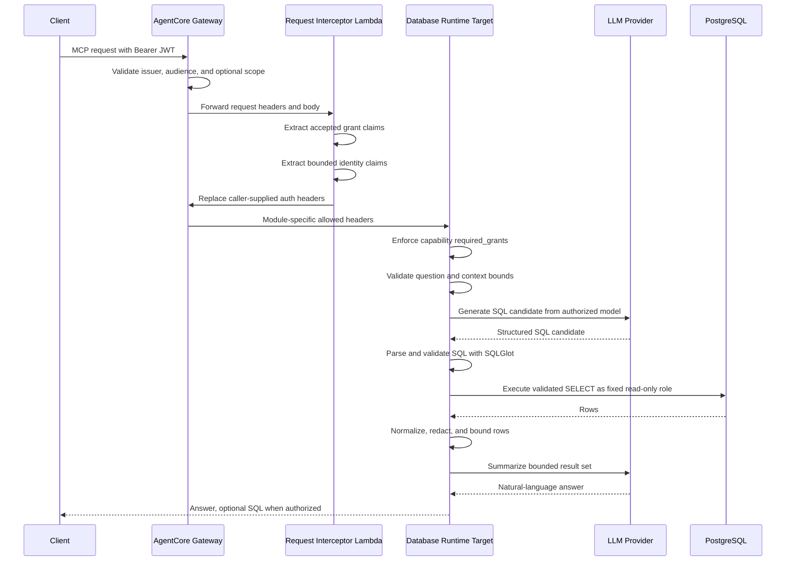

# Security Architecture

This document describes the security architecture of the modular tool hub
deployed with Amazon Bedrock AgentCore Gateway and AgentCore Runtime.

The first implemented module is the read-only database capability,
`ask_database`. The same Gateway is intended to evolve into a hub for other
tools, knowledge bases, retrieval services, or specialized agents. Each module
must declare its own authorization grants, downstream identity model, header
contract, audit requirements, and data minimization rules.

## Executive Summary

AgentCore Gateway is the security front door and routing hub for tool modules.
Callers authenticate to the Gateway with an OIDC/JWT access token. The Gateway
validates the token and a request interceptor derives trusted authorization
grants and bounded caller identity claims for downstream targets.

The database module is the first target behind the hub. It uses a fixed
technical identity stored in AWS Secrets Manager. End users are authorized to
use the capability, but PostgreSQL sees the module's read-only database role
rather than the individual caller. Fine-grained database exposure is enforced
through approved views, role grants, SQL validation, read-only transactions,
output filtering, and timeouts.

The hub is designed for mixed identity models. Some modules will use fixed
service identities. Others may need on-behalf-of-user access through AgentCore
Identity or another approved delegated credential pattern. A module must not
inherit another module's trust assumptions by default.

The LLM is never trusted as a security boundary. In the database module it may
propose SQL, but the SQL must pass deterministic validation with SQLGlot before
execution. Future LLM-backed modules must provide equivalent deterministic
guards appropriate to their domain.

## Hub Modularity Principles

The Gateway hub follows these modular security principles:

- **One hub, many contracts**: Gateway can expose multiple targets, but each
  target owns its own authorization, headers, identity mode, and audit contract.
- **No implicit inheritance**: a new module does not inherit database-module
  grants, headers, prompts, credentials, or data handling rules.
- **Least-context routing**: Gateway and interceptors pass only the grants,
  identity claims, or tokens needed by the selected target.
- **Capability-first authorization**: permissions are named for the action or
  capability, such as `data:read`, `docs:read`, `kb:query`, or
  `tickets:create`.
- **Identity mode is explicit**: every module declares whether it uses a fixed
  service identity or delegated caller authority.
- **Domain guardrails are local**: SQL validation belongs to the database
  module; retrieval filters belong to knowledge-base modules; action approval
  belongs to write-capable modules.
- **Auditing is uniform, details are module-specific**: all modules should emit
  traceable structured audit events, while each module adds relevant resource
  identifiers and policy decisions.

## Trust Flow



## Security Boundaries

The hub design has shared boundaries plus module-local boundaries:

1. **Gateway boundary**: authenticates inbound callers and performs first-pass
   authorization using OIDC/JWT validation. Gateway is shared by modules.
2. **Interceptor boundary**: derives trusted grants and bounded caller identity
   from validated tokens, then strips caller-forged internal headers.
3. **Target boundary**: each target enforces its own capability policy from
   trusted headers and applies module-specific input/output controls.
4. **Resource boundary**: each downstream resource enforces its own final
   controls, such as database grants, KB filters, SaaS ACLs, or internal API
   policies.
5. **LLM boundary**: LLM prompts and completions are untrusted data. Fixed code
   and deterministic validators make authorization and safety decisions.

## Deployment Role Inventory

The bootstrap deployment creates the IAM roles used by the shared Gateway hub,
the request interceptor, and AgentCore Runtime targets. For multi-agent
deployments, these IAM roles are created once per environment by the bootstrap
stack and reused by each database Runtime/target instance.

| Role | Created By | Trusted Principal | Main Permissions | Used By |
| --- | --- | --- | --- | --- |
| `data-agent-runtime-<environment>` | `infrastructure/bootstrap.yaml` | `bedrock-agentcore.amazonaws.com` | Read versioned artifacts and config from the artifact bucket, read Secrets Manager secrets under `/data-agent/<environment>/*`, invoke Bedrock models, and write AgentCore logs. | AgentCore Runtime stacks for database targets. |
| `data-agent-gateway-<environment>` | `infrastructure/bootstrap.yaml` | `bedrock-agentcore.amazonaws.com` | Invoke AgentCore Runtime and invoke the request interceptor Lambda. | AgentCore Gateway and GatewayTarget routing. |
| `data-agent-scope-propagation-<environment>` | `infrastructure/bootstrap.yaml` | `lambda.amazonaws.com` | AWS managed basic Lambda execution permissions for CloudWatch logging. | Request interceptor Lambda. |

The `GatewayTarget` resources do not create separate IAM roles. They use
`CredentialProviderType: GATEWAY_IAM_ROLE`, so Gateway invokes target Runtime
endpoints through the shared Gateway role.

The database technical role is not created by CloudFormation. It is prepared in
the target PostgreSQL database using the SQL templates under `postgres/`, then
stored indirectly in each instance's Secrets Manager connection string. For
multiple database agents, create a separate database role and secret per
instance whenever the read perimeter differs.

Role and credential ownership summary:

- **Caller identity**: external OIDC/JWT principal, validated by Gateway.
- **Gateway role**: AWS service role used by Gateway to invoke targets and the
  interceptor.
- **Runtime role**: AWS service role used by AgentCore Runtime to read config,
  secrets, invoke models, and log.
- **Interceptor role**: Lambda execution role used only for request
  transformation and logging.
- **Database role**: PostgreSQL read-only technical role used by the database
  agent; it is not the end user's identity.

## Inbound Authentication And Authorization

The Gateway uses `CUSTOM_JWT` authorization. The deployment parameters define:

- `jwt_discovery_url`
- `jwt_allowed_audience`
- `required_scope`

The hub configuration defines how inbound claims are interpreted before
module-specific policy is applied:

```yaml
authorization:
  mode: scopes
  required_scope: data:read
  sql_viewer_scope: data:sql:read
  accepted_claims:
    - scope
    - scp
  identity_claims:
    - sub
    - oid
    - preferred_username
    - appid
    - azp
    - tid
```

Two authorization modes are supported:

- `scopes`: Gateway also configures `AllowedScopes`. Use this for delegated user
  scopes, such as Microsoft Entra ID `scp`. Accepted claims must be limited to
  `scope` and `scp`.
- `claims`: Gateway validates issuer and audience; the interceptor and Runtime
  enforce grants from accepted claims such as Entra ID `roles`. Accepted claims
  must be `roles`.

## Request Interceptor

The Gateway request interceptor is a Lambda function deployed in
`infrastructure/bootstrap.yaml`.

The interceptor:

- decodes the already-validated inbound JWT;
- extracts grants from configured claims such as `scope` and `scp` in `scopes`
  mode, or `roles` in `claims` mode;
- denies the request if `required_scope` is missing;
- extracts only allowlisted identity claims;
- removes caller-supplied `authorization`, `x-data-agent-grants`, and
  `x-data-agent-identity` headers;
- injects trusted `x-data-agent-grants` and `x-data-agent-identity` headers.

The Runtime and Gateway target allowlist only these internal headers:

```yaml
RequestHeaderAllowlist:
  - x-data-agent-grants
  - x-data-agent-identity
```

This avoids trusting client-provided authorization headers while still giving
the Runtime the caller context it needs for capability decisions and audit.

Implementation note: the interceptor code is currently embedded inline in the
CloudFormation template. Runtime authorization helpers live separately in
`app/authorization.py` because the Runtime consumes trusted headers while the
interceptor decodes inbound JWT claims. A dedicated test loads and executes the
inline Lambda handler from the template to reduce drift risk. If the interceptor
logic grows, promote it to a versioned source file and either package it as a
Lambda artifact or add a CI check that verifies the inline `ZipFile` matches the
canonical source.

## Capability And Target Model

Capabilities declare both authorization and downstream identity expectations.
The current database capability is:

```yaml
capabilities:
  - name: ask_database
    target: data-agent
    identity_mode: service
    required_grants:
      - data:read
    sql_viewer_grant: data:sql:read
```

`identity_mode: service` means the target uses its own technical identity for
downstream access. For `ask_database`, PostgreSQL sees the fixed read-only role
from Secrets Manager, not the final caller.

`identity_mode: on_behalf_of_user` is reserved for future targets that must
access downstream systems with delegated caller authority, such as SharePoint,
Jira, Salesforce, or an internal API that enforces user-level permissions. Such
capabilities must declare at least:

```yaml
identity_mode: on_behalf_of_user
downstream_audience: <resource-audience>
credential_provider_name: <agentcore-identity-provider>
```

Those targets should use AgentCore Identity on-behalf-of token exchange, or an
approved equivalent, instead of passing raw bearer tokens through all targets.

Example modular hub policy:

```yaml
capabilities:
  - name: ask_database
    target: data-agent
    identity_mode: service
    required_grants: [data:read]
    sql_viewer_grant: data:sql:read

  - name: query_security_kb
    target: security-kb
    identity_mode: service
    required_grants: [kb:query]

  - name: search_user_documents
    target: user-documents
    identity_mode: on_behalf_of_user
    required_grants: [docs:read]
    downstream_audience: api://sharepoint-or-internal-docs
    credential_provider_name: entra-docs-obo

  - name: create_ticket
    target: ticketing
    identity_mode: on_behalf_of_user
    required_grants: [tickets:create]
    downstream_audience: api://ticketing-api
    credential_provider_name: entra-ticketing-obo
```

Each target should receive only the headers it needs. A knowledge-base target
may need grants and identity claims for audit. An OBO target may need a
credential-provider configuration and token-exchange context. A fixed-identity
database target should not receive raw inbound bearer tokens.

## Source Organization

The Python source layout mirrors the hub model:

```text
app/
├── authorization.py          Shared grant and caller-identity helpers
├── audit.py                  Shared structured audit helper
├── config.py                 Shared validated configuration model
└── capabilities/
    └── database/
        ├── database.py       SQLAlchemy execution and DB transaction controls
        ├── llm.py            SQL generation and result summarization chains
        ├── models.py         Public tool and structured LLM models
        ├── security.py       Database-module input/output controls
        └── sql_validator.py  SQLGlot validation for generated SQL
```

Future modules should be added under `app/capabilities/<module>/` rather than
expanding the database package. Shared code should move to top-level `app/`
only when at least two modules genuinely need it. This keeps domain guardrails
local and prevents a KB, document, or action agent from inheriting database
assumptions accidentally.

## Grant Semantics

`data:read` is the base permission for using the database module's
`ask_database` capability. Without it, the Runtime rejects the request.

`data:sql:read` is an additional disclosure permission. It allows SQL visibility
only when the caller also sets `include_sql=True`. Without this grant, the user
can receive the natural-language answer but not the generated SQL.

This separation lets business users consume answers while reserving technical
query visibility for analysts, auditors, or operators.

Future modules should use similarly narrow grants:

- `kb:query` for querying an approved knowledge base.
- `docs:read` for user-delegated document search.
- `tickets:create` for ticket creation.
- `incidents:read` for incident retrieval.
- `actions:approve` for high-impact tool execution approvals.

## Database Access Model

This section is specific to the database module. Other modules must define
equivalent resource-local controls for their own downstream systems.

The Runtime loads the database connection string from Secrets Manager through
`DATABASE_SECRET_ARN`.

The database role is expected to be:

- a fixed technical role;
- read-only;
- granted only to approved schemas/views;
- denied broad access to physical source tables;
- constrained by statement and transaction settings.

The PostgreSQL setup applies:

```sql
SET TRANSACTION READ ONLY;
SELECT set_config('statement_timeout', :timeout_ms, true);
```

The project includes PostgreSQL templates for:

- creating a read-only role;
- granting only authorized relations;
- verifying denied write access.

This means Gateway authorization decides who may invoke the agent, while the
database role and views decide what the agent can ever read.

## SQL Generation And SQLGlot Validation

This section is specific to the database module.

The LLM receives the authorized logical data model and produces a structured SQL
candidate. That candidate is untrusted until
`app/capabilities/database/sql_validator.py` validates it with SQLGlot.

SQLGlot parses the SQL into an AST. The validator then enforces:

- exactly one statement;
- statement root must be `SELECT`;
- no `SELECT INTO`;
- no `SELECT *`;
- every physical relation must be in `data_model.allowed_relations`;
- every selected column must be authorized for its relation;
- globally denied columns are rejected;
- functions must be listed in `data_model.allowed_functions`;
- `LIMIT` must be a literal integer when present;
- the server applies an absolute maximum row bound;
- the final SQL is re-rendered from the validated AST.

This is stronger than regex-based validation because checks operate on parsed
SQL structure rather than string shape.

SQLGlot does not replace database permissions. It is a deterministic gate before
execution; the database remains the final authority.

## Input And Output Controls

These controls are implemented for the database module. Other modules should
define equivalent local checks before invoking LLMs, retrievers, APIs, or
action tools.

Before calling the LLM, the database Runtime rejects obvious out-of-scope
requests:

- write intents such as insert, update, delete, drop, create, alter, truncate;
- Spanish equivalents such as borrar, eliminar, actualizar, modificar;
- requests for passwords, credentials, secrets, tokens, or API keys;
- oversized questions or context payloads.

After database execution, rows are normalized:

- row count is bounded;
- denied columns are removed;
- cell length is capped;
- configured redaction patterns are applied;
- only a bounded subset is sent for summarization.

Operational rejection and error messages are fixed configuration values and do
not invoke the LLM.

## Secrets And Configuration

Non-sensitive configuration is stored in versioned S3 objects and loaded on each
invocation:

- data model;
- prompts;
- query limits;
- authorization config;
- capability config;
- output controls.

Sensitive values are stored in Secrets Manager:

- database URI;
- OpenAI API key when OpenAI is explicitly enabled.

The Runtime IAM role can read only secrets under:

```text
/data-agent/<environment>/*
```

The deployment scripts validate that parameter files do not contain `REPLACE`
markers and that secret ARNs match the deployment environment.

## Network And Runtime Controls

The database Runtime is deployed in VPC mode with configured private subnets and
security groups. Future targets may have different network requirements and
should be deployed with their own least-privilege network posture. Recommended
supporting controls include:

- private database routing;
- VPC endpoints for S3, Secrets Manager, and Bedrock where possible;
- NAT only when an approved external provider is required;
- database connection limits for the technical role;
- read replica usage for analytical traffic;
- CloudWatch log retention aligned with data governance policy.

## Observability And Audit

Audit events are structured JSON logs. All modules should emit a common audit
envelope:

- event name;
- trace ID;
- target or capability name;
- caller subject or client identifier when available;
- authorization grants used;
- identity mode;
- elapsed time;
- outcome.

The database module additionally records:

- provider and model;
- relations used;
- row count;

Current audit does not make PostgreSQL see the final caller. If database-native
per-user auditing is required, a future change should set approved session
metadata such as `application_name` or a custom session variable after careful
review, without using it as the only authorization control.

## Adding Gateway Targets

Additional targets should be treated as new security modules. They should not
inherit the database target contract by default. Each target should define:

- target name;
- exposed tools;
- required grants;
- identity mode;
- allowed request headers;
- credential provider configuration when OBO is needed;
- audit fields;
- data minimization rules.
- deterministic guardrails for its domain.
- resource-specific residual risks.

Common target patterns:

```yaml
capabilities:
  - name: query_security_kb
    target: security-kb
    identity_mode: service
    required_grants: [kb:query]

  - name: search_user_documents
    target: user-documents
    identity_mode: on_behalf_of_user
    required_grants: [docs:read]
    downstream_audience: api://sharepoint-or-internal-docs
    credential_provider_name: entra-docs-obo

  - name: create_ticket
    target: ticketing
    identity_mode: on_behalf_of_user
    required_grants: [tickets:create]
    downstream_audience: api://ticketing-api
    credential_provider_name: entra-ticketing-obo
```

Targets using `on_behalf_of_user` should receive only the token or context
required for token exchange and should avoid broad propagation of inbound JWTs.

Knowledge-base targets should define retrieval filters, source allowlists,
document sensitivity labels, citation behavior, and answer redaction controls.
Action-oriented agents should define approval gates, idempotency controls,
rollback expectations, and explicit write grants.

## Threats Addressed

The architecture mitigates:

- unauthenticated access to the Gateway;
- client-forged grant headers;
- missing or incorrect JWT audience;
- accidental cross-module reuse of the database target header contract;
- accidental LLM-generated write SQL;
- multi-statement SQL injection;
- unauthorized relation or column access through generated SQL;
- excessive row disclosure;
- secret disclosure through obvious prompt requests;
- sensitive output leakage through denied columns and redaction;
- long-running database statements through statement timeouts.

## Residual Risks And Required Production Controls

The architecture still requires operational hardening:

- Gateway authorization does not provide per-consumer quotas by itself.
- Gateway-level auth is shared, but target-level policy must be reviewed per
  module.
- `LIMIT` caps returned rows, not all database work.
- The fixed database role means all authorized users share the same database
  read perimeter.
- Prompt injection can still influence answer wording, even though SQL execution
  is validated.
- Redaction depends on configured patterns and approved view design.
- OBO targets require separate AgentCore Identity or IdP credential-provider
  configuration before they are safe to expose.
- Knowledge-base and non-SQL modules require their own deterministic guardrails;
  SQLGlot only protects the database module.

Recommended production controls:

- per-client quotas and rate limits;
- cost alarms;
- anomaly detection on query volume and row counts;
- database monitoring for the technical role;
- explicit security-barrier views where available;
- regular review of allowed relations and columns;
- CI checks for configuration drift and placeholder parameters.

## Design Decisions

Current accepted decisions:

- Treat AgentCore Gateway as a modular tool hub, not a single-purpose database
  facade.
- Use a fixed service identity for `ask_database`.
- Keep user authorization at Gateway and Runtime, not in PostgreSQL RLS.
- Use `data:read` for base agent access.
- Use `data:sql:read` for SQL disclosure.
- Propagate only bounded caller identity claims, not the raw inbound JWT.
- Use SQLGlot for deterministic SQL validation.
- Treat LLM output as untrusted until validated.
- Prepare future targets for `service` or `on_behalf_of_user` identity modes.
- Require each future target to declare its grants, identity mode, header
  contract, audit fields, and domain guardrails.

Open decisions for future targets:

- which downstream systems need OBO;
- which AgentCore Identity credential providers are required;
- which grants map to each target;
- how knowledge-base targets enforce document-level access and sensitivity
  labels;
- whether high-impact action targets require approval workflows;
- whether any target needs database-native user audit metadata;
- whether Gateway should be split by trust domain if targets diverge heavily.
